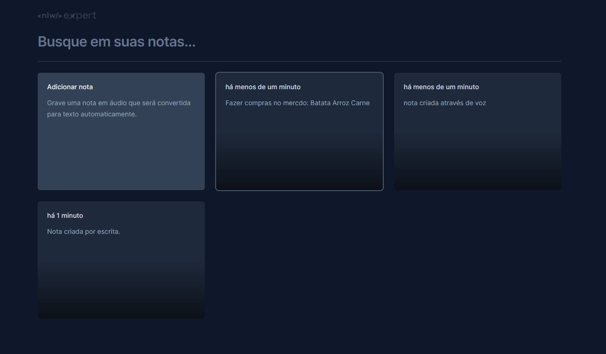

# NLW Expert (React)

Essa aplicação foi desenvolvida durantew o evento NLW Experts da Rocketseat.

## Técnologias

- [React com Vite](https://vitejs.dev/guide/)
- [TypeScript](https://www.typescriptlang.org/)
- [Tailwind com vite](https://tailwindcss.com/docs/guides/vite)
- [SpeechRecognition API](https://caniuse.com/?search=SpeechRecognition%20api)
- [Lucide Icons](https://lucide.dev/icons/)
- [Date-fns](https://date-fns.org/)
- [Radix UI](https://www.radix-ui.com/themes/docs/overview/getting-started)
- [Sonner](https://sonner.emilkowal.ski/)
- [Pnpm](https://pnpm.io/pt/)

## Clonar repositório

Pode abrir seu terminal de preferência no local desejado e colocar o código abaixo:

```sh
git clone https://github.com/juanvieiraprado99/nlw-expert-notes.git
```

## Executando

Após clonar o repositório, acesse a pasta do projeto e execute os comandos abaixo:

```sh
pnpm install
pnpm run dev
```

Acesse http://localhost:5173 no navegador para visualizar a aplicação.
